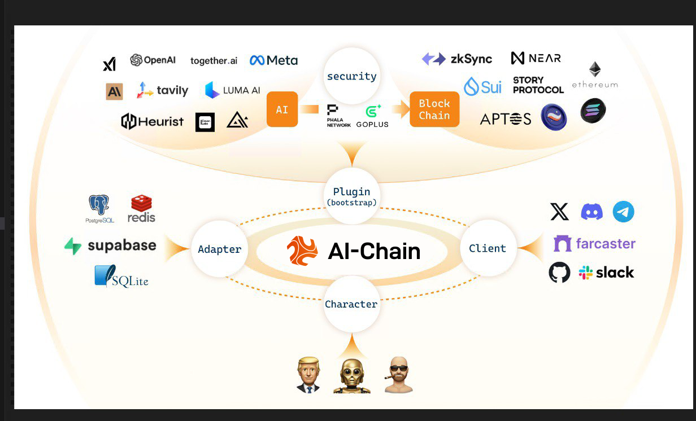

# AI-Chain 🤖
**The first decentralized AI computing network, revolutionizing distributed AI, data, privacy, and smart contracts for a smarter Web3 ecosystem.**

  

## 🚩 Overview

  

 

## 🌟 **What is AI-Chain?**  
AI-Chain aims to empower AI computing through blockchain, creating a decentralized, efficient, and secure AI network that drives deep integration between AI and the Web3 ecosystem. 

  

 

Amid the wave of technological advancements, Artificial Intelligence (AI) and Blockchain stand out as two of the most disruptive innovations. AI delivers powerful computing and data analysis capabilities, while blockchain is known for its decentralization, security, and transparency. However, centralized AI computing resources, data privacy risks, and inefficiencies in smart contracts hinder their deep integration.

AI-Chain was born from a profound understanding of these challenges. Our founding team consists of blockchain developers, AI researchers, and Web3 ecosystem builders, all committed to creating a decentralized AI computing network, ensuring AI computations run securely, trustworthily, and transparently on a global scale. 

---

## 🛠️ **Current Status**  
We are at the **idea and planning stage** and are currently:  
- Designing the platform’s architecture.  
- Researching blockchain platforms (e.g., Ethereum, Solana).  
- Outlining AI use cases for transaction analysis and anomaly detection.  

This is an exciting time to join us as you’ll help shape the foundation of the platform!  

---

## 🤝 **We Are Looking For**  
We’re actively looking for passionate contributors to help bring AI-Chain to life. If you’re a developer or enthusiast interested in blockchain or AI, we’d love to hear from you!  

### **Open Roles:**  
1. **Blockchain Developers**  
   - **Skills Required:**  
     - Experience with Solidity or Rust.  
     - Knowledge of Ethereum, Solana, or other blockchain platforms.  
   - **Responsibilities:**  
     - Develop and test smart contracts.  
     - Integrate blockchain functionality into the platform.  

2. **AI/ML Specialists**  
   - **Skills Required:**  
     - Experience with Python, TensorFlow, or PyTorch.  
     - Familiarity with data analysis and anomaly detection.  
   - **Responsibilities:**  
     - Design and train AI models to analyze transaction patterns.  
     - Build algorithms for reputation scoring.  

3. **Frontend Developers**  
   - **Skills Required:**  
     - Experience with React.js, Vue.js and Next.js.  
     - Ability to create user-friendly and responsive interfaces.  
   - **Responsibilities:**  
     - Develop a dashboard for users to visualize transaction data.  
     - Implement AI-powered insights into the frontend.
  
  4. **Backend Developers**  
   - **Skills Required:**  
     - Strong experience with backend frameworks like Node.js, Django, or FastAPI.  
     - Familiarity with RESTful APIs, GraphQL, and database management (PostgreSQL, MongoDB).  
     - Understanding of microservices architecture is a plus.  
   - **Responsibilities:**  
     - Design and implement scalable backend services for data processing.  
     - Integrate AI models and blockchain data into the backend architecture.  
     - Ensure the security and reliability of server-side applications.    

---

## 📋 **How to Get Started**  
If you’re interested in joining us, here’s how you can contribute:  
1. **Fork this repository** and explore the project files.  
2. Check the [Issues](https://github.com/AICWeb3/AI-Chain/issues) section for tasks labeled `help wanted` or `good first issue`.  
3. Read our [Contribution Guidelines](CONTRIBUTING.md) for more details.  
4. Review the [Roadmap](ROADMAP.md) to see our planned milestones.  
5. Share your ideas and suggestions by opening a new Issue or participating in Discussions.  

---

## 🌱 **Why Join AI-Chain?**  
- **Be part of an innovative project** at the cutting edge of blockchain and AI.  
- **Gain real-world experience** in building smart contracts, AI models, and user interfaces.  
- **Collaborate with a passionate team** aiming to create a transparent and secure blockchain ecosystem.  

---

## 🔗 **Useful Links**  
- [🌍 Roadmap](ROADMAP.md): See the planned milestones and goals for the project.  
- [🤝 Contribution Guidelines](CONTRIBUTING.md): Learn how to get involved and contribute to the project.  

---

## 📞 **Contact Us**  
Have questions or want to get involved? Reach out to us:  
- **X:** [X@AIChainLabs](https://x.com/AIChainLabs)
- **Discord:** [Join our community](https://discord.com/invite/aichain)  
- **Telegram:** [@AichainPro](https://t.me/AichainPro)
- **Medium:** [@Ai-Chain](https://ai-chain.medium.com)
- **Gitbook:** [Docs](https://docs.aichain.finance/)
- **Official Website:** [View](https://aichain.finance/)
- **Email:** [info@aichain.finance](mailto:info@aichain.finance)  

---

## 🛡️ **License**  
This project is licensed under the MIT License. See the [LICENSE](LICENSE) file for more details.  

Let’s build a platform that brings trust and security to the blockchain world! 🚀  